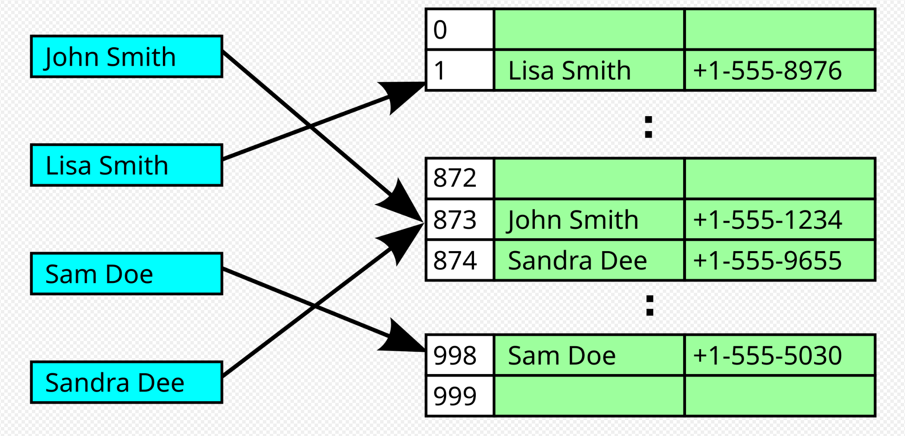
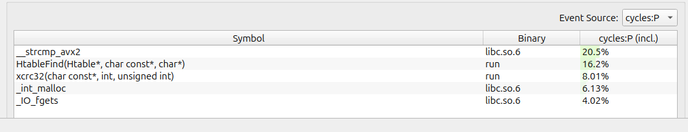
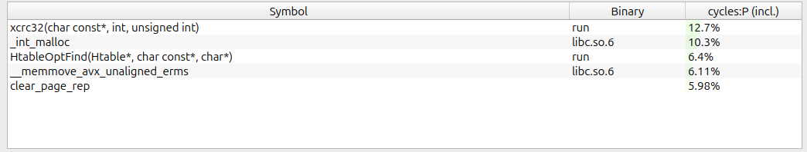
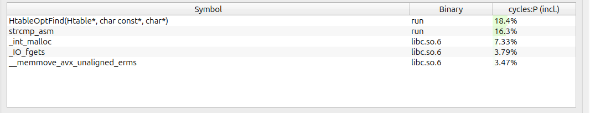
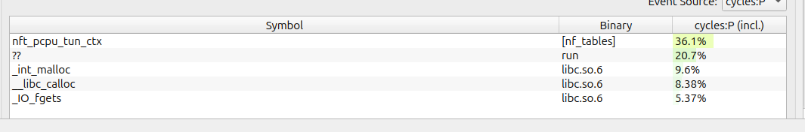

# Hash Table Research

  | OS | Hardware |
  |------|------|
  | Ubuntu 24.10 | AMD Ryzen 7 6800H with Radeon Graphics            3.20 GHz |
  | DESKTOP-JTSUO0I       | 16 GB RAM                                                  |
  | Ubuntu clang version 19.1.1 (1ubuntu1) |
  | gcc (Ubuntu 14.2.0-4ubuntu2) 14.2.0    |

## What we need to do?
1. Write your own implementation of hash table
2. Analyze its speed using ```perf, valgrind, hotspot```
3. Find the __hottest__ functions
4. Optimize them using intrinsic-functions and assembler
5. Calculate the boost
6. EAT, SLEEP, REPEAT

## What is a hash table?
- Hash table is a structure for storing your data
- It is easy and fast to write
- It works faster than any other storing structure (tree, list etc.)

### Main idea

There are several ways to write a hash table. We will use chain-addressing in our hash table.
The bins where we put our info are lists forming linear sequences of words.
The search function in this implementation consists of **counting hash** and **linear search**



---
##### ЗЫ (other hash-table implementations)
| Implementation name | Idea |
|---------------------|------|
| Double hashing      | Replace __list__ with mini hash table (so it's hash-table matryoshka). |
| Open Addressing     | Hash table is a linear sequence of arrays. No pointers to lists.       |
| [Robin Hood](https://www.youtube.com/watch?v=Q4dDoJ4JZ4I)          | Based on swapping PSL (probe sequence length) when we hit the bottom of the bucket |


---


### Better hash == Homogeneous hash.
We should choose hash-functions which give us the most homogeneous info distribution.
Remember: **COLLISIONS ARE BAD**. They decrease the efficiency of your hash table _search function_.


Your data should be kept smoothly to keep an optimal [load factor](#load-factor) of 1.5 but we are going to keep it **15** for better optimization.


Keeping load factor as low as possible reduces **linear search** in bins, that's why it makes hash tables work faster

#### Load factor

```python
load_factor = sum([len(list) for list in hash_table]) / bins
```
#### Hash-function
- Using crc2 hash function
- In the next iterations we will optimize this spot and use SIMD hash functions
```c
unsigned int xcrc32 (const char *buf, int len, unsigned int init)
{
  unsigned int crc = init;
  while (len--)
    {
      crc = (crc << 8) ^ crc32_table[((crc >> 24) ^ *buf) & 255];
      buf++;
    }
  return crc;
}
```

## Parsing text
For parsing text we will use python script ```bookparser.py``` that generates us a word-list file, where you can choose its alignment.

This allows us to load our strings as __m128 or _m256 variables and use intrinsic functions for string comparsion.
It will boost our perfomance.


The book we are going to parse is ```HARRY POTTER!!!```
---

Hope my optimizations will work faster than ```-O3``` with the help of Magic!

We are going to parse the text with several methods.
The first method is default
```
...
Harry
Potter
and
the
Sorcerers
Stone
CHAPTER
ONE
THE
BOY
WHO
LIVED
Mr
...
```

Loading Parameters into our table
| Bins | Load Factor | Words Loaded | Words Searched |
|------|-------------|--------------|----------------|
 128| 15.6| 2000 | 20000

```
 <<<LOG FILE OF HASH TABLE>>>
Load factor = 15.625000
[BIN 0]
----------------------------------
	 did
	 hed
	 upset
	 hear
	 Potters
	 bear
	 Mugglers
	 Potters
	 Potter
	 stop
	 do
----------------------------------
...
```
We will use **perf**, **hotspot**  and **hyperfine** for profiling our hash table.

Use these commands for profiling
```
hyperfine --warmup 100 './run'
hyperfine --runs 1000 './run'

sudo perf record ./run
sudo hotspot
```

It is needed to load frequently used blocks of memory to cache, this way we can make the experiment more repeatable,
because it won't be dependent of cache-misses.

| Compiler | Flags | Time|
|----------|-------|------------|
| g++ | -O0 |163.2 ms ±  1.3 ms 	|
| g++ | -O1 |158.5 ms ±  0.9 ms  	|
| g++ | -O2 |162.3 ms ±   2.9 ms  |
| g++ | -O3 |161.5 ms ±  1.6 ms	|
| g++ | PGO (profile guided optimization) | 170.4 ms ±  4.9 ms





As we see, the hottest function here is ```_strcmp_avx2```

### First enemy - strcmp

Let's write our own strcmp function using intrinsic functions.

A little bit about inline assembler syntax

```
__asm__ (
    "asm code"
    : output_operands // return value
    : input_operands  // parameters
    : clobbers		  // trash registers
);
```
This is a C implementation of our strcmp function

```c
int strcmp_asm(const char * s1, const char * s2)
{
    __m256i ymm_string1 = _mm256_loadu_si256((__m256i*) s1);
    __m256i ymm_string2 = _mm256_loadu_si256((__m256i*) s2);

    int mask = _mm256_testc_si256(ymm_string1, ymm_string2);

    return mask;
}
```

This is how it looks like in asm

```
strcmp_asm(char const*, char const*):
        vmovdqu ymm0, YMMWORD PTR [rdi]
        xor     eax, eax
        vptest  ymm0, YMMWORD PTR [rsi]
        setc    al
        vzeroupper
        ret
```

This is how we write it using inline assembler

1. We move a string by address %1 (which is in rdi register) to ymm0
2. Then we use ```vptest``` instructuion which counts (~a & b) of ymm register and address and sets the carry flag to 1 if it equals zero (which is basically means registers are equal)
3. ```setc``` is for setting the lowest byte of rax to the value of carry flag
4. ```vzeroupper``` zeros hugher 128 bits of ymm

```"+&r" (mask)``` - _'+'_ is for read&write mode, _'&'_ is a mark that this value is modified (prevents compiler from assigning the same register to input and output). _'r'_ - request for placing it in **general-purpose register**


```c
static inline int strcmp_asm(const char * el1, const char * el2)
{

    int mask = 0;

    __asm__ __volatile__ (
    ".intel_syntax noprefix             \n\t"
    "vmovdqu ymm0, [%1]                \n\t"
    "xor eax, eax                       \n\t"
    "vptest ymm0,  [%2]                \n\t"
    "setc %b0                            \n\t"
    "vzeroupper                         \n\t"
    ".att_syntax prefix                 \n\t"

    :"+&r" (mask)
    :"r" (el1), "r" (el2)
    : "ymm0"

    );

    return mask;

}
```



| Previous time | Current time |Boost|
|------|-----|------|
 163.0 ms ±  1.3 ms | 145.7 ms ± 1.8 ms | 12.4% |

### Second enemy - hash function

The second approach we will use is intrinsic functions.
You won't believe it, but **crc32** has its intrinsic-implementation.


#### This is called


---

This is a function for counting crc32 hash using intrinsic functions.


```
uint32_t icrc32(const char* string)
{
    uint32_t crc = 0;
    crc = _mm_crc32_u64(crc, *((uint64_t*)string +  0));
    crc = _mm_crc32_u64(crc, *((uint64_t*)string +  1));
    crc = _mm_crc32_u64(crc, *((uint64_t*)string +  2));
    crc = _mm_crc32_u64(crc, *((uint64_t*)string +  3));

    return crc;
}
```

| Previous time | Current time |Boost|
|------|-----|------|
 145.7 ms ±  1.3 ms | 132.3 ms ± 1.8 ms | 10.1% |



Now the hottest function is HtableOptFind.

Let's compile this function in [godbolt](https://godbolt.org/z/bf7WG1ebG) and see other bottlenecks.

```
HtableOptFind(Htable*, char const*, char*):
        xor     eax, eax
        xor     edx, edx

        crc32   rax, QWORD PTR [rsi]        ;
        crc32   rax, QWORD PTR [rsi+8]      ;   CRC32 PART
        crc32   rax, QWORD PTR [rsi+16]     ;
        crc32   rax, QWORD PTR [rsi+24]     ;

        div     QWORD PTR [rdi]
        mov     rax, QWORD PTR [rdi+16]
        movsx   rdx, edx
        mov     rax, QWORD PTR [rax+rdx*8]
        test    rax, rax
        je      .L6
        xor     edi, edi
        jmp     .L5
.L9:
        mov     rax, QWORD PTR [rax+32]
        test    rax, rax
        je      .L6
.L5:
        mov     rcx, QWORD PTR [rax]
        mov     edx, edi
        xor eax, eax
        vmovdqu ymm0, YMMWORD PTR [rsi]
        vptest ymm0,  YMMWORD PTR [rcx]
        setc dl
        vzeroupper

        test    edx, edx
        je      .L9
        xor     eax, eax
        ret
.L6:
        mov     eax, -1
        ret
```

First line to change is this line ```div QWORD PTR [rdi]```

We have 128 bins but compiler doesnt't know anything about it.
So let's change this instruction to

```
and eax, 127
mov rax, QWORD PTR [rdx+rax*8]
test rax, rax
```

We also change the main cycle of our program. We don't need to execute ```vzeroupper``` every time because we don't change AVX registers to SSE in our program. That's why let's call it only once before ```ret```.

Then we write it in a separate [file](src/tablefind.asm) and link it with other .o files.

That's the full code example.

```asm
section .text

global HtableOptFind

HtableOptFind:
    xor eax, eax

    ;-----------------------------
    ; CRC32 FIELD                |
    ;-----------------------------

    mov     rdx,    qword [rdi+16]
    crc32   rax,    qword [rsi]
    crc32   rax,    qword [rsi+8]
    crc32   rax,    qword [rsi+16]
    crc32   rax,    qword [rsi+24]

    ;----------------------------|

    and     eax,    1023                ;
    mov     rax,    qword [rdx+rax*8]   ; int bin = icrc32(string) % 128
    test    rax,    rax                 ;
    je      .FinishProg
    xor     edi,    edi
    jmp     .HtableCycle

.HtableStopCycle:
    mov rax, qword [rax+32]
    test rax, rax
    je .FinishProg

.HtableCycle:                           ; for (List * lst = tab->table[bin]; lst; lst = lst->nxt)
    mov rcx, qword [rax]
    mov edx, edi

    vmovdqu ymm0, yword [rsi]           ; Moving string to YMM
    vptest  ymm0, yword [rcx]           ; ~(s1 & s2)
    setc    dl                          ;  Set dl if CF == 1 (s1 equals s2)

    test edx, edx
    je .HtableStopCycle
    mov eax, 6                          ; return HTABLE_FOUND;

    vzeroupper
    ret

.FinishProg:
    mov eax, 7                          ; return HTABLE_NOT_FOUND;
    ret

```




Now nft_pcpu_tun_ctx is on top. Still guessing what's that but it is something from Linux Kernel. Although let's see the final results of our optimization.

| Previous time | Current time |Boost|
|------|-----|------|
 132.3 ms ±  1.8 ms | 118.03 ms ± 2.0 ms | 10.8% |


 ## FINALS RESULTS

 | Iteration | Time | Relative boost | Absolute boost |
|------|-----|------|-----|
 0|163.0 ms ±  1.3 ms|  0.0%  | 0.0 %
 1|145.7 ms ± 1.8 ms | 12.4% | 12.4%
 2|132.3 ms ± 1.8 ms | 10.1% | 23.2%
 3|118.03 ms ± 2.0 ms | 10.8% | 38.1%

 We see that combination of three different optimizations boosted our performance up to **38 %**.

 This is an educational example of research so we can stop on these iteration. But in other cases we would continue optimizing our program, because 10% is still a big relevant boost.

 ### Other optimizations

Let's decrease a load factor to 2.

| Previous time | Current time |Boost|
|------|-----|------|
 118.03 ms ±  2.0 ms | 92.5 ms ± 1.5 ms | 27.6% |


This way we decrease a linear search in our table which basically reduces the number of address tranistions. That's why it works even faster.

### REMARK

Of course this optimization breaks all our previous work because now we have different *flame graph*. So, if that would be a real research work, we would at first do algorithmic optimizations which don't include **assembly** code or use of intrinsics. But in our studying case we used large load-factor to increase the influence of functions with linear search and find different ways of optimizing it without algorithmic approaches

# FINAL SPEECH

This task is aimed at forming an understanding about optimizing the code for a specific case. This is how we learn to understand how a particular algorithm will work, not in an ideal case, but on a specific hardware.

Based on the results, it can be seen that the contribution of algorithmic optimizations and optimizations at the instruction level is comparable, which means that for the effective operation of the program you need to be able to use both approaches.
