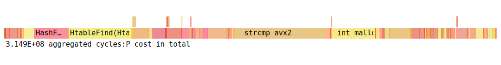

# Hash Table Research

  | OS | Hardware |
  |------|------|
  | Ubuntu 24.10 | AMD Ryzen 7 6800H with Radeon Graphics            3.20 GHz |
  | DESKTOP-JTSUO0I       | 16 GB RAM                                                  |
  | Ubuntu clang version 19.1.1 (1ubuntu1) |
  | gcc (Ubuntu 14.2.0-4ubuntu2) 14.2.0    |

## What we need to do?
1. Write your own implementation of hash table
2. Analyze it's speed using ```perf, valgrind, hotspot```
3. Find the __hottest__ functions
4. Optimize them using SIMD instructions and assembler
5. Count the boost
6. EAT, SLEEP, REPEAT

## What is a hash table?
- Hash table is a structure for storing your data
- It is easy and fast to write
- It works faster than any other storing structure (tree, list etc.)

### Main idea
```
you have these bins where you put your data
to put in a bin you count hash of your data

# this is how you get the number of bin
---------------------
index = hash % bins |
---------------------

0       1       2       3
|       |       |       |
[]      []      []      []
[]      []      []      []
[]      []      []      []
```

### Better hash == Random hash.
Your data should be kept smoothly to keep an optimal [load factor](#load-factor) of 1.5 but we are going to keep it **15** for better optimization.


Keeping load factor as low as possible reduces **linear search** in bins, that's why it makes hash tables work faster

#### Load-factor

```python
load_factor = sum([len(list) for list in hash_table]) / bins
```
#### Hash-function
- Using djb2 hash function (fast & easy to write)
- In the next iterations we will optimize this spot and use SIMD hash functions
```c
int64_t HashFunction(const void * elem, size_t size)
{
    int64_t hash = 5381;
    const char * str = (const char *) elem;
    for (int i = 0; i < size; i++)
    {
        hash = ((hash << 5) + hash) + str[i];
    }

    return hash;
}
```

## Parsing text
For parsing text we will use python script ```bookparser.py``` that generates us a word-list file, where you can choose its alignment.

This allows us to load our strings as __m128 or _m256 variables and use intrinsic functions for string comparsion.
It will boost our perfomance.


The book we are going to parse is ```HARRY POTTER!!!```
---

Hope my optimizations will work faster than ```-O3``` with the help of Magic!

We are going to parse the text with several methods.
The first method is default
```
...
Harry
Potter
and
the
Sorcerers
Stone
CHAPTER
ONE
THE
BOY
WHO
LIVED
Mr
...
```

Loading Parameters into our table
| Bins | Load Factor | Words Loaded | Words Searched |
|------|-------------|--------------|----------------|
 128| 15.6| 2000 | 20000

```
 <<<LOG FILE OF HASH TABLE>>>
Load factor = 15.625000
[BIN 0]
----------------------------------
	 did
	 hed
	 hed
	 Potters
	 hed
	 upset
	 upset
	 hed
	 upset
	 Potters
	 hed
	 did
	 Potters
	 Potters
	 Potters
	 Potters
	 did
----------------------------------
...
```
We will use **perf** and **hotspot** for profiling our hash table.

Use these commands for profiling
```
sudo perf record ./run
sudo hotspot
```

| Compiler | Flags | Time, s | FlameGraph |
|----------|-------|------------|---------|
| gcc | -O0 |2.673 |  |
| gcc | -O1 |2.239 |  |
| gcc | -O2 |2.238 |  |
| gcc | -O3 |2.225 |  |

As we see, the hottest function here is ```_strcmp_avx2```

The second hottest function is ```HtableFind```

The third is ```HashFunction```


